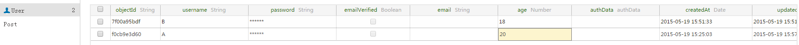
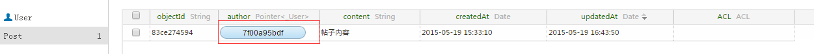
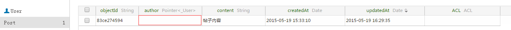
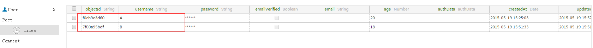
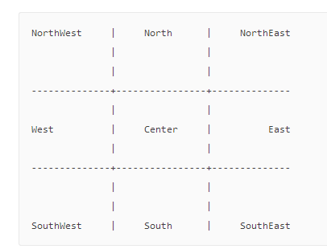
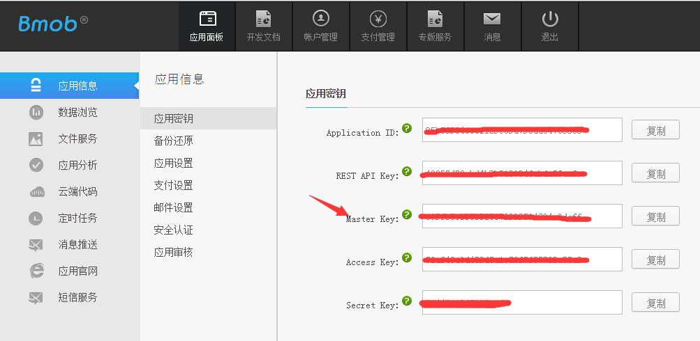
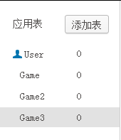

## 简介

Bmob平台为您的移动应用提供了一个完整的后端解决方案，我们提供轻量级的SDK开发包，让开发者以最小的配置和最简单的方式使用Bmob平台提供的服务，进而完全消除开发者编写服务器代码以及维护服务器的操作。


## 快速入门

建议您在阅读本开发文档之前，先阅读我们提供的 [php快速入门文档](http://docs.bmob.cn/phpsdk/index.html?menukey=otherdoc&key=phpsdk)，便于您后续的开发。


## 应用程序
在Bmob平台注册后，每个账户可创建多个应用程序，创建的每个应用程序有各自的Application ID，应用程序将凭其Application ID使用Bmob SDK。

## 应用安全

请大家在使用Bmob开发应用程序之前，仔细阅读“数据与安全”的文档：[http://docs.bmob.cn/datasafety/index.html?menukey=otherdoc&key=datasafety](http://docs.bmob.cn/datasafety/index.html?menukey=otherdoc&key=datasafety)

## 数据类型

目前为止，我们支持的数据类型有String、Integer、Boolean、ArrayList以及BmobObject对象类型。同时Bmob也支持BmobDate、BmobGeoPoint、BmobFile数据类型。

## php sdk相关类的说明

```
lib/BmobObject.class.php:对象操作类
lib/BmobUser.class.php：用户操作类
lib/BmobBatch.class.php：批量操作类
lib/BmobFile.class.php：文件操作类
lib/BmobImage.class.php：图片操作类
lib/BmobRole.class.php：权限类
lib/BmobPush.class.php：推送类
lib/BmobPay.class.php：支付类
lib/BmobSms.class.php：短信消息类
lib/BmobApp.class.php：app操作类
lib/BmobSchemas.class.php：数据表操作类
lib/BmobTimestamp.class.php：获取服务器时间类
lib/BmobCloudCode.class.php：云端代码类
lib/BmobBql.class.php：bql操作类
```

## 对象

一个数据对象（APP中创建的BmobObject类和子类）对应于Bmob后台的一个数据表。

### 数据对象
Bmob存储的数据是建立在BmobObject基础上的，所以任何要保存的数据对象必须继承自BmobObject类。BmobObject类本身包含`objectId`、`createdAt`、`updatedAt`、`ACL`四个默认的属性，objectId是数据的唯一标示，相当于表的主键，createdAt是数据的创建时间，updatedAt是数据的最后修改时间，ACL是数据的操作权限。

如，你的游戏中使用GameScore表来记录玩家的比分信息，其中表的字段有：score（分数）、playerName（玩家名字）属性，那么这个数据对象如下定义：

```php

$bmobObj = new BmobObject("GameScore");
$bmobObj->create(array("playerName"=>"game","score"=>20)); //添加对象
```


**需要注意的是：**

- php不需要对`objectId`、`createdAt`、`updatedAt`、`ACL`四个属性进行定义。
- 不少开发者会没有注意到`createdAt`和`updatedAt`属性中的字母`d`，写成createAt和updateAt。

### 对象格式
通过php sdk保存数据，这个数据是无模式化的（Schema Less）,这意味着你不需要提前标注每个对象上有哪些Key，你只需要随意设置key-value对就可以，php sdk后端会存储它的。

举个例子，假设你正在记录一局游戏的最高分，一个简单的对象可能包含:
```
array(
	"score"=> 1337,
	"playerName"=> "Sean Plott",
	"cheatMode"=> false
)
```
Key必须是字母和数字组成的字符串,Value可以是任何可以JSON编码的东西.

每个对象都有一个类名，你可以通过类名来区分不同的数据，例如，我们可以把游戏得分对象称之为GameScore.我们推荐你使用  **NameYourClassesLikeThis** 和 **nameYourKeysLikeThis** 这样的格式为你的类名和Key命名，这可以使你的代码看起来很漂亮.

当你从[Bmob](http://www.bmob.cn/ "Bmob移动后端云服务平台")中获取对象时，一些字段会被自动加上: createdAt, updatedAt 和 objectId， 这些字段的名字是保留的，你不能自行设置它们，我们上面设置的对象在获取时应该是下面的样子.
```
array(
    "score"=> 1337,
    "playerName"=> "Sean Plott",
    "cheatMode"=> false,
    "createdAt"=> "2011-08-20 02:06:57",
    "updatedAt"=> "2011-08-20 02:06:57",
    "objectId"=> "e1kXT22L"
)
```

createdAt和updatedAt都是UTC时间戳,以ISO 8601标准和毫秒级精度储存:YYYY-MM-DD HH:MM:SS. objectId是一个string,在类中唯一表明了一个对象。

###  数据类型
到现在为止我们只使用了可以被标准JSON编码的值，[Bmob](http://www.bmob.cn/ "Bmob移动后端云服务平台")移动客户端SDK库同样支持日期,地理位置数据和指针数据、关系型数据。在php sdk中，这些值都被编码了，同时有一个"__type"字段来标识出它们所属的类型，所以如果你采用正确的编码的话就可以读或者写这些字段了。

Date类型包含了一个"iso"字段存储了一个UTC时间戳,以ISO 8601格式和毫秒级的精度来存储时间: YYYY-MM-DDTHH:MM:SS.MMMZ，或者 YYYY-MM-DDTHH:MM:SS
```
array(
    "__type"=>"Date",
    "iso"=>"2011-08-21 18:02:52"
)
```

File类型是在上传后返回的JSON数据再加一个Key为"__Type":"File", 用来保存到数据列为文件类型的值：
```
array(
    "__type"=>"File",
    "group"=> "group1",
    "filename"=> "1.xml",
    "url"=> "M00/01/14/sd2lkds0.xml"
)
```


Pointer 类型是在当前对象要指向另一个对象时使用，它包含了 className 和 objectId 两个作为一个指针正确指向的必填值.
```
array(
  "__type"=> "Pointer",
  "className"=> "Game",
  "objectId"=> "DdUOIIIW"
)
```
指向用户对象的 **Pointer** 的 **className** 为_User, 前面加一个下划线表示开发者不能定义的类名, 而且所指的类是系统内置的。

**Relation** 类型被用在多对多的类型上, 移动端的库将使用 **BmobRelation** 作为值, 它有一个 className 字段表示目标对象的类名：
```
array(
  "__type"=> "Relation",
  "className"=> "GameScore"
)
```
当使用查询时， **Relation** 对象的行为很像是 **Pointer** 的数组, 任何操作针对于 **Pointer** 的数组的 (除了 include) 都可以对 **Relation** 起作用.

当更多的数据类型被加入的时候, 它们都会采用 hashmap **加上一个 type** 字段的形式, 所以你不应该使用type作为你自己的JSON对象的Key。


## 添加数据

添加数据使用BmobObject对象的`create`方法，就可以将当前对象的内容保存到Bmob服务端。

例如，你现在要保存一条游戏分数的记录，代码如下：

```php

$bmobObj = new BmobObject("GameScore");
$res=$bmobObj->create(array("playerName"=>"比目","score"=>89)); //添加对象

```

运行以上代码，如果添加成功，你可以在Bmob提供的后台的数据浏览中看到类似这样的结果：

```php
objectId: "0c6db13c", score: 89, playerName: "比目",createdAt:"2013-09-27 10:32:54", updatedAt:"2013-09-27 10:32:54"
```

**这里需要注意的是：**
    
1. 如果服务器端不存在GameScore表，那么系统将自动建表，并插入数据。
    
2. 如果服务器端已经存在GameScore表，和相应的score、playerName字段，那么你此时添加的数据和数据类型也应该和服务器端的表结构一致，否则会保存数据失败。
    
3. 每个BmobObject对象都有几个默认的键(数据列)是不需要开发者指定的，`objectId`是每个保存成功数据的唯一标识符。`createdAt`和`updatedAt`代表每个对象(每条数据)在服务器上创建和最后修改的时间。这些键(数据列)的创建和数据内容是由服务器端自主来完成的。`因此，使用create和update方法时,如果保存了objectId对象，否则会出现提示：“It is a reserved field: objectId(105)”--表明objectId为系统保留字段，不允许修改。`。

## 查询数据

数据的查询可能是每个应用都会频繁使用到的，可以使用BmobObject类，它提供了多样的方法来实现不同条件的查询，同时它的使用也是非常的简单和方便的。

### 查询所有数据

查询某个数据表中的所有数据是非常简单的查询操作，例如：查询GameScore表中playerName为“比目”的50条数据记录。

```php
$res=$bmobObj->get("",array('where={"playerName":"比目"}','limit=50'));
```

查询的结果不需要进行任何处理，BmobSDK已经为你封装成相应的php集合了，你直接使用即可。


### 查询单条数据

当我们知道某条数据的`objectId`时，就可以根据`objectId`直接获取单条数据对象。例如：查询`objectId`为`a203eba875`的人员信息。

```php

$res=$bmobObj->get("a203eba875"); 

```

### 查询条件

在查询的使用过程中，基于不同条件的查询是非常常见的，BmobQuery同样也支持不同条件的查询。


比如需要查询playerName不等于“Barbie”的数据时可以这样写：

```php
$res=$bmobObj->get("",array('where={"playerName":{"$ne":"Barbie"}}'));
```

当然，你可以在你的查询操作中添加多个约束条件，来查询符合要求的数据。例如，下面的例子是查询playerName不等于“Barbie”，score大于90的数据

```php
$res=$bmobObj->get("",array('where={"playerName":{"$ne":"Barbie"},"score":{"$gt":90}}'));
```

如果你想查询匹配几个不同值的数据，如：要查询“Barbie”,“Joe”,“Julia”三个人的成绩时，你可以使用下面的方法来实现。

```php
$res=$bmobObj->get("",array('where={"playerName":{"$in":["Barbie","Joe","“Julia"]}}'));
```

相反，如果你想查询排除“Barbie”,“Joe”,“Julia”这三个人的其他同学的信息，你可以使用`$nin`来实现。

```php
$res=$bmobObj->get("",array('where={"playerName":{"$nin":["Barbie","Joe","“Julia"]}}'));
```

为了获得score得分包括数组中所有的值，如score是[1,3, 5]就满足，是[1, 5,10]就不满足:

```php
$res=$bmobObj->get("",array('where={"score":{"$all":[1,3,5]}}'));
```

为了获取playerName不在列表中的GameScore对象们，我们可以:

```php
$res=$bmobObj->get("",array('where={"playerName":{"$nin":["Jonathan Walsh","Dario Wunsch","Shawn Simon"]}}'));
```

为了获取有分数的对象，我们应该用::

```php
$res=$bmobObj->get("",array('where={"score":{"$exists":true}}'));
```

为了获取没有分数的对象，用:

```php
$res=$bmobObj->get("",array('where={"score":{"$exists":false}}'));
```

你还可以使用模糊查询，支持PCRE正则表达式：

```php
$res=$bmobObj->get("",array('where={"playerName":{"$regex":"smile.*"}}'));
```

如果您的查询条件某个列值要匹配另一个查询的返回值，举例有一个队伍(Team)保存了每个城市的得分情况且用户表中有一列为用户家乡(hometown), 您可以创建一个查询来寻找用户的家乡是得分大于0.5的城市的所有运动员， 就像这样查询:

```php
$res=$bmobObj->get("",array('where={"hometown":{"$select":{"query":{"className":"Team","where":{"winPct":{"$gt":0.5}}},"key":"city"}}}'));
```

反之查询Team中得分小于等于0.5的城市的所有运动员，构造查询如下：

```php
$res=$bmobObj->get("",array('where={"hometown":{"$dontSelect":{"query":{"className":"Team","where":{"winPct":{"$gt":0.5}}},"key":"city"}}}'));
```


下面是查询时支持的参数：


| Key        | Operation |
| :----:  | :----:  |
| $lt     | 小于 |
| $lte     | 小于等于 |
| $gt     | 大于 |
| $gte     | 大于等于 |
| $ne     | 不等于 |
| $in     | 包含在数组中 |
| $nin     | 不包含在数组中 |
| $exists     | 这个 Key 有值 |
| $select	 | 匹配另一个查询的返回值 |
| $dontSelect	 | 排除另一个查询的返回 |
| $all     | 包括所有给定的值 |
| $regex     | 匹配PCRE表达式 |


### 分页查询
你可以用limit和skip来做分页，limit的默认值是100，但是任何1到1000的值都是可选的，就是说，为了获取在400到600之间的对象:

```php
$res=$bmobObj->get("",array('where={"playerName":"game"}','limit=200','skip=400'));
```

### 结果排序

你可以用order参数指定一个字段来排序，前面加一个负号的前缀表示降序，这样返回的对象会以score升序排列:

```php
$res=$bmobObj->get("",array('where={"playerName":"game"}','order=score'));
```

而以下这样返回的对象会以score降序排列:

```php
$res=$bmobObj->get("",array('where={"playerName":"game"}','order=-score'));
```

你可以用多个字段进行排序，只要用一个逗号隔开列表就可以，为了获取GameScore，以score的升序和name的降序进行排序:

```php
$res=$bmobObj->get("",array('where={"playerName":"game"}','order=score,-name'));
```

### 统计对象数量

如果你在使用limit，或者如果返回的结果很多，你可能想要知道到底有多少对象应该返回，而不用把它们全部获得以后再计数，此时你可以使用count参数。举个例子，如果你仅仅是关心一个特定的玩家玩过的游戏数量：


```php
$res=$bmobObj->get("",array('where={"playerName":"game"}','limit=0','count=1'));
```

因为请求了count而且把limit设为了0，返回的值里面只有计数，results为空数组集。

```
{ ["count"]=> int(6) ["results"]=> array(0) { } }
```

### 复合查询

| Key        | Operation |
| :----:  | :----:  |
| $or     | 复合查询中的或查询 |
| $and     | 复合查询中的与查询 |

如果你想查询对象符合几种查询之一，你可以使用$or或$and操作符，带一个JSON数组作为它的值。例如，如果你想找到player赢了很多或者赢了很少，你可以用如下的方式:

```php
$res=$bmobObj->get("",array('where={"$or":[{"wins":{"$gt":150}},{"wins":{"$lt":5}}]}'));
```

查询今天内的数据，方式如下:

```php
$res=$bmobObj->get("",array('where={"$and":[{"createdAt":{"$gte":{"__type": "Date", "iso": "2014-07-15 00:00:00"}}},{"createdAt":{"$lte":{"__type": "Date", "iso": "2014-07-15 23:59:59"}}}]}'));
```


**因为createdAt updatedAt服务器自动生成的时间，在服务器保存的是精确到微秒值的时间，所以基于时间类型比较的值要加1秒。**

任何在查询上的其他的约束都会对返回的对象生效，所以你可以用$or对其他的查询添加约束。


注意我们不会在 **组合查询的子查询** 中支持非过滤型的约束(例如:limit skip sort include)，但最外层的查询中是支持非过滤型约束的。

### 查询指定列

你可以限定返回的字段，通过传入keys参数，值为用一个逗号分隔的字段名称列表，为了获取对象只包含score和playerName字段(还有特殊的内置字段比如objectId,createdAt和updatedAt)，请求如下：

```php
$res=$bmobObj->get("",array('$res=$bmobObj->get("",array("keys=score,playerName"))'));
```

### 使用 BQL 查询

我们还提供类 SQL 语法的 BQL 查询语言来查询数据，例如：

```php
     $bmobBql = new BmobBql();
      $res = $bmobBql->query(array('bql'=>'select * from GameScore where score=11'));  
```

更多请参考 [BQL 详细指南](http://docs.bmob.cn/bql/index.html?menukey=otherdoc&key=bql "BQL 详细指南") 。

BQL 还支持占位符查询，where 和 limit 子句的条件参数可以使用问号替换，然后通过 `values` 数组传入：

```php
    $bmobBql = new BmobBql();
    $res = $bmobBql->query(array('bql'=>'select * from GameScore where score=?', 'values'=>'[11]'));  

```

## 修改数据

为了更改一个对象上已经有的数据，你可以发送一个PUT请求到对象相应的URL上，只有你指定的Key的值才会变更为新值，任何你未指定的Key的值都不会更改，所以你可以只更新对象数据的一个子集。例如，我们来更改我们对象的一个score的字段:

```php
$res=$bmobObj->update("16d846f51c", array("score"=>60));
```
返回的JSON对象只会包含一个updatedAt字段，表明更新发生的时间：
```
{ ["updatedAt"]=> string(19) "2015-10-26 16:33:51" }
```

## 删除数据

为了在[Bmob](http://www.bmob.cn/ "Bmob移动后端云服务平台")上删除一个对象，可以发送一个DELETE请求到指定的对象的URL，比如:

```php
$res=$bmobObj->delete("bd89c6bce9"); //删除对象bd89c6bce9
```

## 删除字段

你可以在一个对象中删除一个字段，通过Delete操作:

```php
 $res=$bmobObj->deleteField("ZS5wHHHV","score"); //在一个对象中删除一个字段
```

## 数组

为了存储数组型数据，[Bmob](http://www.bmob.cn/ "Bmob移动后端云服务平台")提供了3种操作来原子性地更改一个数组字段:

**Add** 在一个数组字段的后面添加一些指定的对象(包装在一个数组内)

**AddUnique** 只会在原本数组字段中没有这些对象的情形下才会添加入数组，插入数组的位置不固定的

**Remove** 从一个数组字段的值内移除指定的数组中的所有对象

### 添加数组数据

添加一行记录时创建一个普通的数组类型字段，可以使用以下方法添加：

```php
 $res=$bmobObj->addArray("list",array("person1","person2"));
```

### 更新数组数据

每一种方法都会有一个objects，即包含了这些方法将被添加或删除的对象列表，举个例子，技能skills是一个类似于集合的数组类型，那么我们可以在skills中加入一些对象，只有在skills原来的对象中不包含这些值的情况下才会被加入:

```php
 $res=$bmobObj->updateArray("ZS5wHHHV","skills",array("flying","kungfu")); 
```

### 查询数组数据

对于Key的类型是数组的情况，可以查找Key的数组值中包含有2的对象:

```php
$res=$bmobObj->get("",array('where={"arrayKey":2}'));
```

你同样可以使用"$all"操作符来找到类型为数组的Key的值中包含有2,3和4的对象:

```php
$res=$bmobObj->get("",array('where={"arrayKey":{"$all":[2,3,4]}}'));
```

### 删除数组数据
同理我们可以使用Remove这个操作在把这些对象从skills中移除：

```php
$res=$bmobObj->deleteArray("ZS5wHHHV","skills",array("flying","kungfu")); 
```

### 使用索引和对象key修改数组中的对象
比如你当前行有一列叫用户的工作经验projectExperiences，是一个Array数组列，里面包含了多个对象值：[{"name":"项目名称","descr":"项目描述"，"startTime":"开始时间"，"endTime":"结束时间"}, ...]

那么我们要修改projectExperiences数组中第一个对象的name值：

```php
$bmobUser = new BmobUser();
$res=$bmobUser->update("16d846f51c", array("projectExperiences.0.name"=>"项目名称2"));
```

## 修改对象的某个值
比如你当前行有一列叫userAttibute,保存的是一个JSON 对象，比如是: {"name":"John", "gender":"男"}

那么我们要修改这个对象的某个Key的值：

```
$res=$bmobObj->update("16d846f51c", array("userAttibute.gender"=>"女")); 
```


## 数据关联

### 关联关系描述

在程序设计中，不同类型的数据之间可能存在某种关系。

比如：帖子和作者的关系，一篇帖子只属于某个用户，这是`一对一的关系`,

比如：帖子和评论的关系，一条评论只属于某一篇帖子，而一篇帖子对应有很多条评论，这是`一对多的关系`,

比如：学生和课程的关系，一个学生可以选择很多课程，一个课程也可以被很多学生所选择，这是`多对多的关系`。

Bmob提供了`Pointer（一对一、一对多）`和`Relation（多对多）`两种数据类型来解决这种业务需求。

#### 本案例的场景描述

由于关联关系讲解起来比较复杂，以下用一个简单的案例来说明在Bmob中是如何使用关联关系的。

场景：**用户发表帖子，同时又可对帖子进行评论留言。**

在这个场景中涉及到三个表：用户表（`_User`）、帖子表（`Post`）、评论表（`Comment`）,以下是各个表的字段：

`_User`字段如下：

<table>
<tr><th> 字段 </td><th>类型</th><th>  含义</th></tr>
<tr><td> objectId </td><td>  String</td><td>  用户ID</td></tr>
<tr><td> username </td><td>  String</td><td>  用户名(可以既发帖子又发评论)</td></tr>
<tr><td> age </td><td>  Integer</td><td>  年龄</td></tr>
</table>

----------

`Post`字段如下：

<table>
<tr><th> 字段 </td><th>  含义</th><th>  类型</th></tr>
<tr><td> objectId </td><td>  String</td><td> 帖子ID </td></tr>
<tr><td> title </td><td>  String</td><td> 帖子标题 </td></tr>
<tr><td> content </td><td>  String</td><td> 帖子内容 </td></tr>
<tr><td> author </td><td>  Pointer<_User></td><td> 帖子作者 </td></tr>
<tr><td> likes </td><td>  Relation<_User></td><td> 喜欢帖子的读者 </td></tr>
</table>


----------

`Comment`字段如下：

<table>
<tr><th> 字段 </td><th>  含义</th><th>  类型</th></tr>
<tr><td> objectId </td><td>  String</td><td> 评论ID </td></tr>
<tr><td> content </td><td>  String</td><td> 评论内容 </td></tr>
<tr><td> post </td><td>   Pointer< Post></td><td> 评论对应的帖子 </td></tr>
<tr><td> author </td><td>  Pointer<_User></td><td> 评论该帖子的人 </td></tr>
</table>


----------

#### Web端创建关联字段

如果你需要在Web端创建上述表的话，那么当选择的字段类型为`Pointer或Relation`时，会提示你选择该字段所指向或关联的数据表。

如下图所示：


以下举例均假定A用户已注册并登陆



### 一对一关系

**用户发表帖子，一篇帖子也只能属于某个用户，那么帖子和用户之间的关系是`一对一关系`，建议使用`Pointer`类型来表示。**

`Pointer`本质上可以看成是我们将一个指向某条记录的指针记录下来，我们查询时可以通过该指针来获得其指向的关联对象。

用户A（该ObjectId为“0290813a89”）写了一篇帖子，需要在`Post`表中生成一条记录，并将该帖子关联到用户A这条记录，表明该帖子是A所发表的。

示例如下：


```php
	$post = new BmobObject("Post");
	$res=$post->addRelPointer("author","_User","0290813a89");
	$res=$post->update($res->objectId, array("content"=>"帖子内容"));
```

添加成功后，在后台的`Post`表中，你就会看到有一条记录生成，并且该帖子的`author`字段的值指向了`_User`表中的`用户A`这条记录。


#### 查询一对一关联


如果想查询用户A（该ObjectId为“0290813a89”）所发表的所有帖子，那么可以这样：

```php
	$post = new BmobObject("Post");
	$res=$post->addRelPointer(array(array("author","_User","0290813a89")));
	$res=$post->update($res->objectId, array("content"=>"帖子内容"));
```


#### 修改一对一关联


如果希望将`83ce274594`这条帖子的作者修改成`用户B`,示例：

```php
	$res=$post->updateRelPointer("83ce274594", "author", "_User", "7f00a95bdf");
```


修改成功后，在后台可查看到`83ce274594`这个帖子的作者已经变更为用户B



#### 删除一对一关联


如果你想和`83ce274594`这个帖子解除关联关系，可以这样：

```php
	$res=$post->deleteField("83ce274594","author");
```


删除成功后，在后台的`Post`表中，你就会看到`83ce274594`这个帖子的`author`字段的值已经被置空了。




### 一对多关系


**一篇评论只能属于某一篇帖子，一篇帖子可以有很多用户对其进行评论，那么帖子和评论之间的关系就是`一对多关系`，推荐使用`pointer`类型来表示**。

因为使用方法和上面的一对一关联基本相同，只是查询一对多关联的时候有些区别，故只举添加和查询两个例子：

#### 添加一对多关联
 
将评论和微博进行关联，并同时和当前用户进行关联，表明是当前用户对该帖子进行评论，示例如下：

```php
	$comment = new BmobObject("Comment");
	$res = $comment->addRelPointer(array(array("author","_User","0290813a89"),array("post","Post","81108a33c8")));
```

#### 查询一对多关联

我想`查询出某个帖子（objectId为81108a33c8）的所有评论,同时将该评论的作者的信息也查询出来`，那么可以使用下面的方法：

```php
	$res = $comment->get("",array('where={"post":{"__type":"Pointer","className":"Post","objectId":"81108a33c8"}}','include=author'));
```


### 多对多关系


**一个帖子可以被很多用户所喜欢，一个用户也可能会喜欢很多帖子，那么可以使用`Relation`类型来表示这种`多对多关联关系`**。

`Relation`本质上可以理解为其存储的是一个对象，而这个对象中存储的是多个指向其它记录的指针。

#### 添加多对多关联


```php
$res = $post->updateRelRelation("83ce274594", "likes", array(array("_User","focb9e3d60")));
```

添加成功后，在后台的`Post`表中就能查看到`likes`字段已经生成并对应到了`_User`


点击红框中的`关联关系`按钮展开后，可查看刚才所添加的喜欢该帖子的用户A：


#### 查询多对多关联


如果希望`查询喜欢该帖子（objectId为83ce274594）的所有用户`，那么可以使用下面的方法：

示例代码：
```php
$res = $bmobUser->get(0,array('where={"$relatedTo":{"object":{"__type":"Pointer","className":"Post","objectId":"83ce274594"},"key":"likes"}}')); 
```

#### 修改多对多关联

如果`用户B也喜欢该帖子（objectId为83ce274594）`，此时需要为该帖子(Post)的`likes`字段多添加一个用户,示例如下：

```
$res=$post->updateRelRelation("83ce274594", "likes", array(array("_User","83ce274594")));
```

修改成功后，你在点击该帖子的`likes`字段下面的`关联关系`按钮展开后，可查看刚才所添加的喜欢该帖子的用户B：



#### 删除多对多关联


如果`想对该帖子进行取消喜欢的操作`，此时，需要删除之前的多对多关联，具体代码：

```php
$res=$post->deleteRelation("81108a33c8", "likes", array(array("_User","eb3e34f23b")));
```

### include用法


在某些情况下，你想在一个查询内获取`Pointer`类型的关联对象。

比如上述示例中，如果希望在查询帖子信息的同时也把该帖子的作者的信息查询出来，可以使用`include`方法

```php
$res=$post->get("",array('include=author'));
```

你可以使用`,`号(逗号)操作符来`include并列查询`两个对象

比如，查询评论表的同时将该评论用户的信息和所评论的帖子信息也一并查询出来（因为Comment表有两个`Pointer类型`的字段），那么可以这样做：

```php
$res=$comment->get("",array('include=author,post'));
```

你同时还可以使用 `. `号（英语句号）操作符来进行`include中的内嵌对象查询`


比如，你想在查询评论信息的同时将该评论`Comment`对应的帖子`post`以及该帖子的作者信息`author`一并查询出来，你可以这样做：

```php
$res=$comment->get("",array('include=post.author'));
```

**注：include的查询对象只能为BmobPointer类型，而不能是BmobRelation类型。**


## 批量数据操作

为了减少因为网络通讯次数太多而带来的时间浪费, 你可以使用下面的批量(batch)操作，在一个请求中对多个普通对象进行添加(create)、更新(update)、删除(delete) 操作，上限为50个。

在一个批量(batch)请求中每一个操作都有自己对应的方法、路径和主体, 这些参数可以代替你通常使用的HTTP方法. 这些操作会以发送过去的顺序来执行, 比如我们要创建一系列的 GameScore 的对象:

```
    $bmobBatch = new BmobBatch();
    $data=array(
    	array(
    		"method"=>"POST",
    		"path"=>"/1/classes/GameScore",
    		"body"=>array(
    					"score"=>1337,
    					"playerName"=>"Sean Plott",
    				),
    	),
    	array(
    		"method"=>"POST",
    		"path"=>"/1/classes/GameScore",
    		"body"=>array(
    					"score"=>1338,
    					"playerName"=>"ZeroCool",
    				),
    	),
    );
    $res=$bmobBatch->batch($data);
```

批量操作的响应会是一个列表, 列表的返回值个数与给定的requests请求个数是相等的。列表中每个返回项都有一个字段是 **"success"** 或者 **"error"**， **"success"** 的值通常和你进行其他REST操作成功时返回的值是一样的:

```
Array
(
    [0] => stdClass Object
        (
            [success] => stdClass Object
                (
                    [createdAt] => 2015-10-30 10:51:52
                    [objectId] => 495ac937b8
                )

        )

    [1] => stdClass Object
        (
            [success] => stdClass Object
                (
                    [createdAt] => 2015-10-30 10:51:52
                    [objectId] => e8597579be
                )

        )

)

```
**"error"** 的值是有返回码和错误信息字符串的一个对象:

```
[error] => stdClass Object
    (
        [code] => 101
        [error] => "object not found for delete"
    )
```
在 batch 操作中更新(update)和删除(delete)同样是有效的，如果相应记录有ACL规则，则必须传入该用户的Token才能进行更新或删除:

```
    $bmobBatch = new BmobBatch();
    $data=array(
    	array(
    		"method"=>"PUT",
			"token"=>"pnktnjyb996sj4p156gjtp4im",
    		"path"=>"/1/users/51e3a334e4b0b3eb44adbe1a",
    		"body"=>array(
    					"score"=>1337,
    				),
    	),
    	array(
    		"method"=>"DELETE",
			"token"=>"pnktnjyb996sj4p156gjtp4im",
    		"path"=>"/1/users/51a8a4d9e4b0d034f6159a35",
    	),
    );
    $res=$bmobBatch->batch($data);
```

## 原子计数器
很多应用可能会有需要计数器的功能，比如某条信息被点赞多少次等。Bmob提供了非常便捷的方式来保证原子性的修改某一数值字段的值。

```php
$bmobObj = new BmobObject("GameScore");
$res=$bmobObj->increment("bd89c6bce9","score",array(2)); //id为bd89c6bce9的field score数值加2

```
同理可以让score像下面一样减少一个固定的值：

```php
$res=$bmobObj->increment("bd89c6bce9","score",array(-2)); //id为bd89c6bce9的field score数值减2
```

## 文件

Bmob的文件上传有整个文件上传和分片上传两种方式，可以分别实现小文件上传和大文件的上传。

### 整个文件上传
上传整个文件到bmob，发送一个POST请求到file路径，参数是：文件名，。
上传一个 hello.txt 文件实现方法如下：

```php
$bmobFile = new BmobFile();
//第一个参数是文件的名称,第二个参数是文件的url(可以是本地路径,最终是通过file_get_contents获取文件内容)
$res=$bmobFile->uploadFile("heelo.txt","http://file.bmob.cn/M02/17/99/oYYBAFYfXS6AKB96AAAABNsGNwg872.txt");
```

返回的主体是一个JSON对象，包含：文件名（filename）、分组（group）、文件地址（url）。 http://file.bmob.cn/ + url 就是文件上传成功后的完整地址，返回的Http Headers中的Location会包含该完整地址:

```php
[filename] => heelo.txt [group] => group1 [url] => M02/57/6A/oYYBAFYy3amAQI7cAAAAAjP0FTs923.txt

```

然后你需要把上传后的文件对象上传:

```php
$fileArray = array("__type"=>"File", "group"=>$res->group,"filename"=>$res->filename,"url"=>$res->url);
$res=$bmobObj->create(array("score"=>11,"file"=>$fileArray)); 
```

### 删除文件

删除文件，必须要知道文件的url，如下：

```php
$res=$bmobFile->delete("M02/54/09/oYYBAFYxx4uAbgTcAAAbpS8UHE45961.js");
```

其中M02/54/09/oYYBAFYxx4uAbgTcAAAbpS8UHE45961.js是文件的url。

返回结果格式如下：

```
{ $msg => "ok" } 
```
**删除文件不会删除文件关联的行记录中的文件列的值，需要自行通过更新行来删除关联。**

## 图片处理
提供一些工具接口， 方便开发者处理图片

### 缩微图
提供原图的URL地址和相应的参数， 返回缩微图的URL地址， 具体参数定义如下：

    mode:模式 0: 指定宽， 高自适应，等比例缩放
         模式 1: 指定高， 宽自适应，等比例缩放
         模式 2: 指定最长边，短边自适应，等比例缩放
         模式 3: 指定最短边，长边自适应，等比例缩放
         模式 4: 指定最大宽高， 等比例缩放
         模式 5: 固定宽高， 居中缩放	
    image:原图片url
    width:宽度，模式 0, 4, 5必填
    height：高度，模式 1, 4, 5必填
    longEdge：长边，模式 2必填
    shortEdge：短边，模式 3必填
    quality：质量，选填, 范围 1-100
    outType：输出类型，0:默认，输出url；1:输出base64编码的字符串流


调用方式如下：

```
$bmobImage = new BmobImage();
$data=array("image"=>"http://file.bmob.cn/M00/01/49/wKhkA1OEmUmAXRToAAIAco88Nk08205940.jpg","mode"=>0, "quality"=>100, 'width'=>100);
$res=$bmobImage->imageThumbnail($data);
```

如果 outType = 0 返回云端url地址:

```
[filename] => e6c8ac18c9.jpg [group] => group1 [url] => M00/01/6E/wKhkA1OGpWKAGdNUAAAjdkbUqo4612.jpg
```

如果 outType = 1 返回文件内容的 base64 字符串：

```
[file] => base64的文件内容
```


#### 水印图
提供原图的URL地址， 水印图的URL地址和相应的参数， 返回缩微图的URL地址， 具体参数定义如下：

    image：原图路径
    watermark：水印图路径
    dissolve:透明度，0-255
    distanceX：横轴边距，单位:像素(px)，缺省值为10
    distanceY：纵轴边距，单位:像素(px)，缺省值为10
    outType：输出类型，0:默认，输出url；1:输出base64编码的字符串流
    gravity:水印位置，见下图



调用方式如下：
```
$data=array("image"=>"http://file.bmob.cn/M01/FB/94/oYYBAFVsLzaATYHUAAInI2Hg05M737.jpg","watermark"=>"http://file.bmob.cn/M01/F8/4C/oYYBAFVru0uAa0yyAAAsGVkLsy8979.jpg",
     	"dissolve"=>100, 'gravity'=>"SouthWest","distanceX"=>10,"distanceY"=>10);
$res=$bmobImage->imagesWatermark($data);
```

如果 outType = 0 返回云端url地址:

```
[filename] => e6c8ac18c9.jpg [group] => group1 [url] => M00/01/6E/wKhkA1OG443AGdNUAAAjdkbUqo4612.jpg
```

如果 outType = 1 返回文件内容的 base64 字符串：

```
[file] => "base64的文件内容
```

## 用户
很多跨平台和跨系统的应用都有一个统一的登录流程，[Bmob](http://www.bmob.cn/ "Bmob移动后端云服务平台")通过REST API访问用户的账户让你实现该功能。

通常来说，用户这个类的功能与其他的对象是相同的，比如都没有限制模式(Schema Less)，User对象和其他对象不同的是一个用户必须有用户名(username)和密码(password)，密码会被自动地加密和存储。[Bmob](http://www.bmob.cn/ "Bmob移动后端云服务平台")强制你username和email这两个Key的值必须是不重复的。

### 属性
[Bmob](http://www.bmob.cn/ "Bmob移动后端云服务平台")默认会有几个特定的属性：
username: 用户的用户名`（必需）`。
password: 用户的密码`（必需）`。
email: 用户的电子邮件地址`（可选）`。

### 注册用户
注册一个新用户与创建一个新的普通对象之间的不同点在于其username和password字段都是必要的，password字段会以与其他的字段不一样的方式处理，它在保存时会被加密而且永远不会被返回给任何来自客户端的请求。

在你的应用设置页面中，你可以向[Bmob](http://www.bmob.cn/ "Bmob移动后端云服务平台")来请求认证邮件地址，这项设置启用了的话，所有用户在注册时填写email这个Key的值，并且邮箱有效的情况下，就会向这个邮箱地址发出一封邮件，邮件中会包含一个来自[Bmob](http://www.bmob.cn/ "Bmob移动后端云服务平台")的邮箱验证的链接，当你的用户查收邮件并点击这个链接后，这个用户emailVerified的Key的值会置为True，你可以在emailVerified字段上查看用户的email是否已经通过验证了。

为了注册一个新的用户，需要向user路径发送一个POST请求，你可以加入一个甚至多个新的字段，例如，创建一个有家庭电话字段的新用户:

```
$bmobUser = new BmobUser();
$res = $bmobUser->register(array("username"=>"cooldude117", "password"=>"p_n7!-e8", "phone"=>"415-392-0202", "email"=>"bmobtest111@126.com")); 
```

当创建成功时,HTTP响应头的状态码返回为201 Created，Http响应头的Location值包含了该新用户的URL:

```
Status: 201 Created
Location: https://api.bmob.cn/1/users/Kc3M222J
```

返回的主体是包含objectId，表示唯一的用户, createdAt时间戳表示用户注册时间, sessionToken可以被用来认证更新或删除这名用户信息的请求。

```
[createdAt] => 2011-11-07 20:58:34, [objectId] => Kc3M222J, [sessionToken] => pnktnjyb996sj4p156gjtp4im, 
```

**这里需要注意一点的是，有些时候你可能需要在用户注册时发送一封验证邮件，以确认用户邮箱的真实性。这时，你只需要登录自己的应用管理后台，在应用设置->邮件设置（下图）中把“邮箱验证”功能打开，Bmob云后端就会在注册时自动发动一封验证邮件给用户。**


设置邮箱验证功能

### 使用手机号码一键注册或登陆

[Bmob](http://www.bmob.cn/ "Bmob移动后端云服务平台") 支持让用户直接输入手机号码进行注册，如果手机号码存在则自动登陆：
```
 $res = $bmobUser->register(array("mobilePhoneNumber"=>"131xxxxxxxx", "smsCode"=>"502845"));
```
其中 **mobilePhoneNumber** 就是手机号码，而 **smsCode** 是使用 [请求短信验证码方法](BmobSms中的sendSms)发送到用户手机上的 6位验证码字符串。如果是新用户且不传入 username，默认用户名将是手机号码。

注册或者登陆成功后，返回的应答跟登陆接口类似：

```
  "username" =>"185xxxxxxxx",
  "mobilePhoneNumber" => "185xxxxxxxx",
  "mobilePhoneVerified" => true,
  "createdAt" => "2011-11-07 20:58:34",
  "updatedAt" => "2011-11-07 20:58:34",
  "objectId" => "Kc3M222J",
  "sessionToken" => "pnktnjyb996sj4p156gjtp4im"
  ……其他属性

```

如果是第一次注册，将默认设置_User表的 **mobilePhoneVerified** 属性为 true。

### 登录用户
你的用户注册之后，你需要让他们用自己的用户名和密码登录，为了做到这一点，发送一个HTTP GET请求到 **/1/login** ，加上username和password作为URL编码后的参数：

```
$res = $bmobUser->login("test111@qq.com","111111");
```

username 支持传入_User表的username或email或mobilePhoneNumber字段的值，作为登录的扩展功能，以实现邮箱和密码、手机号和密码登录功能。

除了有用户名或邮箱或手机号码和密码登录的功能，[Bmob](http://www.bmob.cn/ "Bmob移动后端云服务平台") 还支持使用手机号码和验证码一键快速登录的功能，而 **smsCode** 是使用[请求短信验证码方法](BmobSms中的sendSms)发送到用户手机上的 6位验证码字符串：

```
$res = $bmobUser->loginByMobile("131xxxxxxxx","745399");
```

返回的主体是一个JSON对象，包括所有除了password以外的自定义字段，它同样包含了createdAt,updateAt,objectId和sessionToken字段：

```
    "username"=>"cooldude6",
    "phone"=>"415-392-0202",
    "createdAt"=> "2011-11-07 20:58:34",
    "updatedAt"=>"2011-11-07 20:58:34",
    "objectId"=>"Kc3M222J",
    "sessionToken"=>"pnktnjyb996sj4p156gjtp4im"
```

注：登录后返回的sessionToken是用于更新用户信息，删除用户，修改用户密码，sessionToken的有效期是一年。如果开放者需要实现保持登录状态N天的功能，那么可以在用户信息验证成功后，用php的session做状态保持，控制session的有效期就可以了。


### 获取当前用户
当注册一个用户后，你可以通过发送一个HTTP GET请求到用户注册成功时返回的HTTP请求头中的Location的URL获取用户的信息。比如，为了获取上面注册成功的用户：

```
$res = $bmobUser->get("415b8fe99a"); // 获取id为415b8fe99a用户的信息
```

返回的对象包含所有用户提供的字段,除了密码以外.也包括了createdAt,updatedAt和objectId字段.
```

    "username"=>"cooldude6",
    "phone"=> "415-392-0202",
    "createdAt"=> "2011-11-07 20:58:34",
    "updatedAt"=> "2011-11-07 20:58:34",
    "objectId"=> "415b8fe99a"

```

### 更新用户
在通常的情况下，我们都不希望用户去修改自己的数据，但可以通过认证让用户去做这件事，修改的用户的数据必须要传入sessionToken，这个sessionToken在注册和登录时都会返回。

为了改动一个用户已经有的数据，需要对这个用户的URL发送一个HTTP PUT请求，任何你没有指定的key会保持不变，所以你可以只改动用户信息中的一部分，username和password可以更改，但是新的username不能重复。

比如，如果我们想对 cooldude6 的电话做出一些改动：

```
$res = $bmobUser->update("415b8fe99a", "050391db407114d9801c8f2788c6b25a", array("phone"=>"02011111")); 
```

上面的050391db407114d9801c8f2788c6b25a是sessionToken

返回只有一个updatedAt字段表明更新发生的时间.

```
{
    "updatedAt"=>"2011-11-07 21:25:10"
}
```

如果开发者需要在用户不登录的情况下更新用户的信息，那么phpsdk也提供了直接使用masterKey强制更新用户信息的方案，可通过下面的方法查看masterKey的值：


使用masterKey更新用户信息的方法如下：
```
$res = $bmobUser->updateByMasterKey("0290813a89", "e09fb5cbb5b825c78989504604c0dcff", array("phone"=>"02011122")); // 通过masterKey更新用户的信息
```

上面的e09fb5cbb5b825c78989504604c0dcff是masterKey。

**在更新用户信息时，如果用户邮箱有变更并且在管理后台打开了邮箱验证选项的话，Bmob云后端同样会自动发动一封验证邮件给用户。**

### 删除用户
为了在[Bmob](http://www.bmob.cn/ "Bmob移动后端云服务平台")上删除一个用户，可以向用户的URL上发送一个DELETE请求，前提是你必须填入sessiontoken以便认证授权，例子：

```
$res = $bmobUser->delete("415b8fe99a", "050391db407114d9801c8f2788c6b25a"); // 删除id为415b8fe99a的用户, 第一参数是用户id, 第二个参数为sessiontoken,在用户登录或注册后获取, 必填
```

如果开发者需要在用户不登录的情况下更新用户的信息，那么phpsdk也提供了直接使用masterKey强制更新用户信息的方案，使用masterKey更新用户信息的方法如下：
```
$res = $bmobUser->deleteByMasterKey("0290813a89", "e09fb5cbb5b825c78989504604c0dcff"); // 通过masterKey删除用户
```

上面的e09fb5cbb5b825c78989504604c0dcff是masterKey。

### 查询用户
你可以一次获取多个用户，只要向用户的根URL发送一个GET请求，没有任何URL参数的话，可以简单地列出所有用户：

```
 $res = $bmobUser->get(); // 获取所有用户的信息
```

返回的值是一个JSON对象包括一个results字段, 值是包含了所有对象的一个JSON数组.

```
    [results] => Array
        (
            [0] => stdClass Object
                (
                    [age] => 11
                    [createdAt] => 2015-10-19 15:45:17
                    [email] => test111@qq.com
                    [emailVerified] => 
                    [objectId] => WXHsFFFd
                    [updatedAt] => 2015-10-27 18:03:42
                    [username] => b
                )

            [1] => stdClass Object
                (
                    [createdAt] => 2015-10-22 10:24:49
                    [mobilePhoneNumber] => 13168399536
                    [mobilePhoneNumberVerified] => 1
                    [objectId] => 0290813a89
                    [updatedAt] => 2015-10-26 17:47:00
                    [username] => a
                )

            [2] => stdClass Object
                (
                    [createdAt] => 2015-10-30 14:44:18
                    [email] => bmobtest111@126.com
                    [emailVerified] => 
                    [objectId] => eb3e34f23b
                    [phone] => 415-392-0202
                    [updatedAt] => 2015-10-30 14:44:18
                    [username] => cooldude117
                )

        )
```

浏览器中查看用户表

User表是一个特殊的表，专门存储BmobUser对象。在浏览器端，你会看到一个User表旁边有一个小人的图标。



### 密码重置
你可以使用这项功能，前提是用户将email与他们的账户关联起来.
```
 $res = $bmobUser->requestPasswordReset("bmobxxx@126.com");
```
如果成功的话,返回的值是一个JSON对象。
密码重置流程如下：

1. 用户输入他们的电子邮件，请求重置自己的密码。
2. Bmob向他们的邮箱发送一封包含特殊的密码重置连接的电子邮件，此邮件的模板可在Bmob后台中修改。
3. 用户根据向导点击重置密码连接，打开一个特殊的Bmob页面，输入一个新的密码。
4. 用户的密码已被重置为新输入的密码。

### 使用短信验证码进行密码重置

如果用户有绑定了手机号码，就可以通过手机验证码短信来实现使用手机号码找回密码的功能，先调用发送验证码 $bmobSms->sendSms 会将验证码发送到用户手机上，用户收到验证码并输入后，调用resetPasswordBySmsCode 来为用户设置新的密码：
```
$res = $bmobUser->resetPasswordBySmsCode("111111", "134554"); // 使用短信验证码进行密码重置
```

如果成功的话,返回如下:
```
"msg": "ok"
```
这时，用户就可以用新密码登陆了。


### 提供旧密码方式安全修改用户密码

很多开发者希望让用户输入一次旧密码做一次校验，旧密码正确才可以修改为新密码，因此我们提供了一个单独的方法updateUserPassword来安全地修改用户密码：
```
$res = $bmobUser->updateUserPassword("WXHsFFFd", "d365d5834061d9f6805047131893ae13" , "123456", "111111"); //用户输入一次旧密码做一次校验，旧密码正确才可以修改为新密码
```

WXHsFFFd：为当前登录用户的objectId。
d365d5834061d9f6805047131893ae13：sessionToken


**注意：仍然需要传入 sessionToken，也就是登录用户才可以修改自己的密码。**


### 邮箱验证
设置邮件验证是一个可选的应用设置, 这样可以对已经确认过邮件的用户提供一部分保留的体验，邮件验证功能会在用户(User)对象中加入emailVerified字段, 当一个用户的邮件被新添加或者修改过的话，emailVerified会默认被设为false，如果应用设置中开启了邮箱认证功能，[Bmob](http://www.bmob.cn/ "Bmob移动后端云服务平台")会对用户填写的邮箱发送一个链接, 这个链接可以把emailVerified设置为 true.

emailVerified 字段有 3 种状态可以考虑：

**true** : 用户可以点击邮件中的链接通过[Bmob](http://www.bmob.cn/ "Bmob移动后端云服务平台")来验证地址，一个用户永远不会在新创建这个值的时候出现emailVerified为true。

**false** : 用户(User)对象最后一次被刷新的时候, 用户并没有确认过他的邮箱地址, 如果你看到emailVerified为false的话，你可以考虑刷新 用户(User)对象。

**missing** : 用户(User)对象已经被创建，但应用设置并没有开启邮件验证功能； 或者用户(User)对象没有email邮箱。

#### 请求验证Email
发送到用户邮箱验证的邮件会在一周内失效，可以通过调用 **requestEmailVerifyy** 来强制重新发送：
```
$res = $bmobUser->requestEmailVerify("h622222225@126.com"); //请求验证Email
```

### 用户账户连接

Bmob允许你连接你的用户到第三方账户服务系统，比如新浪微博和QQ，这样就允许您的用户用已经存在的第三方账户直接登录您的App。通过注册或者更新的用户信息的功能，使用 **authData** 字段来保存第三方服务的授权信息就可以做到。一旦用户关联了某个第三方账户，**authData** 将被存储到您的Bmob的用户信息里，并通过登录即可重新获取到。

**authData** 是一个普通的 JSON 对象，它所要求的key根据第三方账户服务不同而不同，具体要求见下面。每种情况下，你都需要自己负责完成整个授权过程 (一般是通过 OAuth 协议，1.0 或者 2.0) 通过连接的API来获取授权信息。

新浪微博的 **authData** 内容:
```
array(
	"authData"=>
		array("weibo"=>array(
			"uid"=>"123456789",
			"access_token"=>"2.00ed6eMCV9DWcBcb79e8108f8m1HdE",
			"expires_in"=>1564469423540,
	))
)

```

腾讯QQ的 **authData** 内容:
```
array(
	"authData"=>
		array("weibo"=>array(
			"openid"=>"2345CA18A5CD6255E5BA185E7BECD222",
			"access_token"=>"12345678-SM3m2avZxh5cjJmIrAfx4ZYyamdofM7IjU",
			"expires_in"=>1382686496,
	))
)

```
匿名用户 (Anonymous user) 的 authData 内容:
```
array(
	"authData"=>array("id"=>"random UUID with lowercase hexadecimal digits")	
)

```

#### 注册和登录

使用一个第三方账户连接服务来注册用户并登录，同样使用POST请求/1/users，只是需要提供authData字段。例如，使用新浪微博账户注册或者登录用户:

```
$data = array(
	"authData"=>
		array("weibo"=>array(
			"uid"=>"123456789",
			"access_token"=>"2.00ed6eMCV9DWcBcb79e8108f8m1HdE",
			"expires_in"=>1564469423540,
	))
);
$res = $bmobUser->register($data);

```

Bmob 会校验提供的 authData 是否有效，并检查是否已经有一个用户连接了这个 authData 服务。如果已经有用户存在并连接了同一个 authData，那么Http响应头将返回 200 OK 和详细信息 (包括用户的 sessionToken):
```
Status: 200 OK
Location: https://api.bmob.cn/1/users/Kc3M222J
```
返回的内容类似
```

  "username"=>"Bmob",
  "createdAt"=>"2011-11-07 21:25:10",
  "updatedAt"=>"2011-11-07 21:25:10",
  "objectId"=>"Kc3M222J",
  "sessionToken"=>"pnktnjyb996sj4p156gjtp4im",
  "authData"=>array(
    "weibo"=>array(
      "uid"=> "123456789",
      "access_token"=> "2.00ed6eMCV9DWcBcb79e8108f8m1HdE",
      "expires_in"=> 1564469423540
    )
  )

```

#### 连接

连接一个现有的用户到新浪微博或者腾讯QQ帐号，可以通过发送一个 PUT 请求附带 authData 字段到以上Location返回的用户URL做到。例如，连接一个用户到腾讯QQ帐号发起的请求类似这样:

```php

$data = array(
	"authData"=>
		array("weibo"=>array(
			"openid"=>"2345CA18A5CD6255E5BA185E7BECD222",
			"access_token"=>"12345678-SM3m2avZxh5cjJmIrAfx4ZYyamdofM7IjU",
			"expires_in"=>1382686496,
	))
);
 $res = $bmobUser->update("415b8fe99a", "050391db407114d9801c8f2788c6b25a", $data));

```

完成连接后，你可以使用匹配的 authData 来认证他们。


#### 断开连接

断开一个现有用户到某个服务，可以发送一个 PUT 请求设置 authData 中对应的服务为 null 来做到。例如，取消新浪微博关联:

```php
$data = array(
	"authData"=>
		array("weibo"=>null
	))
);
$res = $bmobUser->update("415b8fe99a", "050391db407114d9801c8f2788c6b25a", $data));

```


## ACL和角色

数据安全是软件系统中最重要的组成部分，为了更好的保护应用数据的安全，Bmob在软件架构层面提供了应用层次、表层次、ACL（Access Control List：访问控制列表）、角色管理（Role）四种不同粒度的权限控制的方式，确保用户数据的安全（详细请查看[Bmob数据与安全页面](http://docs.bmob.cn/datasafety/index.html?menukey=otherdoc&key=datasafety)，了解Bmob如何保护数据安全）。

其中，最灵活的方法是通过ACL和角色，它的思路是每一条数据有一个用户和角色的列表，以及这些用户和角色拥有什么样的许可权限。

大多数应用程序需要对不同的数据进行灵活的访问和控制，这就可以使用Bmob提供的ACL模式来实现。例如：

- 对于私有数据，读写权限可以只局限于数据的所有者。
- 对于一个论坛，会员和版主有写的权限，一般的游客只有读的权限。
- 对于日志数据只有开发者才能够访问，ACL可以拒绝所有的访问权限。
- 属于一个被授权的用户或者开发者所创建的数据，可以有公共的读的权限，但是写入权限仅限于管理者角色。
- 一个用户发送给另外一个用户的消息，可以只给这些用户赋予读写的权限。

### ACL的格式

在Bmob中，ACL是用array来表示的。这个array的key是objectId（用户表某个用户对应的objectId）或者是 *(表示公共的访问权限)，ACL 的值是 "读和写的权限", 这个array的key总是权限名, 而这些key的值总是 true。

如果您想让一个 id 为 "Kc3M222k" 的用户有读和写一条数据的权限, 而且这个数据应该可以被全部人读取的话，这个ACL的表达方式如下：

```
array(
	"Kc3M222k"=>array(
		"read"=>true,"write"=>true
		)，
	"*"=>array(
		"read"=>true
		)，	
)
```

### 角色和相关操作

在很多情况下，你需要定义一些用户具有某种相同的数据操作权限，而另外一群用户具有另外一种相同的数据操作权限，这时你就可以使用到Bmob的角色（对应Bmob在Web提供的Role表、SDK中的BmobRole类）功能，设置不同的用户组不同的操作权限。角色表有三个特殊字段：

`name` : 必须字段，表示角色名称,而且只允许被设置一次（命名必须由字母, 空格, 减号或者下划线构成）；

`users` :一个指向一系列用户的关系, 这些用户会继承角色的权限；

`roles` : 一个指向一系列子角色的关系, 这些子关系会继承父角色所有的权限。


#### 创建角色

创建一个新角色的方法如下（固定POST数据到https://api.bmob.cn/1/roles中，且必须提供 `name` 字段）：
```
    $bmobRole = new BmobRole();
    $res = $bmobRole->createRole(array("name"=>"Mo1derators", "ACL"=>array("*"=>array("read"=>true,"write"=>true)))); //创建角色

```

如果你要创建一个包括了“用户和子角色”的角色，实现方式如下：

```
$data = array(
	"name"=>"Mo1derators",
	 "ACL"=>array(
		"*"=>array("read"=>true,"write"=>true)
	  )，
	 "roles"=>array(
		 "__op"=>"AddRelation",
		"objects"=> array(
              "__type"=>"Pointer",
              "className"=>"_Role",
              "objectId"=>"Fe441wZ5"
            )
	  ），
)
$res = $bmobRole->createRole($data);
```

当创建成功后返回HTTP如下：

```
Status: 201 Created
Location: https://api.bmob.cn/1/roles/51e3812D
```

#### 获取角色

获取角色对象的方法如下：

```
$res = $bmobRole->getRole("fff849f7d4"); //获取角色
```

响应结果如下：

```
    [ACL] => stdClass Object
        (
            [*] => stdClass Object
                (
                    [read] => 1
                    [write] => 1
                )

        )

    [createdAt] => 2015-10-23 10:19:06
    [name] => Mo1derators
    [objectId] => dcf9ad7d2e
    [updatedAt] => 2015-10-23 10:19:06
```

#### 更新角色

更新角色时，一个很重要的一点是： `name` 字段不可以更改。添加和删除 `users` 和 `roles` 可以通过使用 AddRelation 和 RemoveRelation 操作符进行。

如给 "Moderators" 角色增加 1 个用户，实现如下:

```
    $data=array(
    		array(
    		  "__type"=>"Pointer",
                 "className"=>"_User",
                 "objectId"=>"WXHsFFFd",
    		),
    	);
    $res = $bmobRole->updateRole("d4642acf90", "users", "AddRelation", $data); 

```

删除 "Moderrators" 的一个子角色的实现如下：

```
    $data=array(
    		array(
    		  "__type"=>"Pointer",
                 "className"=>"_User",
                 "objectId"=>"WXHsFFFd",
    		),
    	);
    $res = $bmobRole->updateRole("d4642acf90", "users", "RemoveRelation", $data); 
```

### 角色的使用

设置一条数据的角色权限，需要在ACL中把Key的名字设置为 “`role:` + 角色名称” 。如限制一条数据可以被在 "Members" 里的任何人读到, 而且可以被它的创建者（objectId为`f1766d0b42`）和任何有 "Moderators" 角色的人所修改, 实现方式如下:

```

  "f1766d0b42"=>array(
    "write"=>true
  ),
  "role:Members"=>array(
    "read"=>true
  },
  "role:Moderators"=>array(
    "write"=>true
  }

```

如果这个用户和 "Moderators" 本身就是 "Members" 的子角色和用户，那么，您不必为创建的用户和 "Moderators" 指定读的权限，因为它们都会继承授予 "Members" 的权限。

#### 角色的继承

一个角色可以包含另一个，可以为 2 个角色建立一个父-子关系。 这个关系的结果就是任何被授予父角色的权限隐含地被授予子角色。

这样的关系类型通常在用户管理的内容类的应用上比较常见, 比如在论坛中，有一些少数的用户是 "管理员（Administartors）", 有最高的权限，可以调整系统设置、 创建新的论坛等等。 另一类用户是 "版主（Moderators）"，他们可以对用户发帖的内容进行管理。可见，任何有管理员权限的人都应该有版主的权限。为建立起这种关系, 您应该把 "Administartors" 的角色设置为 "Moderators" 的子角色, 具体来说就是把 "Administrators" 这个角色加入 "Moderators" 对象的 roles 关系之中，实现如下：

```java

    $data=array(
    		array(
    		  "__type"=>"Pointer",
                 "className"=>"_Role",
                 "objectId"=>"<AdministratorsRoleObjectId>",
    		),
    	);
    $res = $bmobRole->updateRole("<ModeratorsRoleObjectId>", "roles", "AddRelation", $data); 

```

## 地理位置
Bmob允许用户根据地球的经度和纬度坐标进行基于地理位置的信息查询。你可以在查询中添加一个GeoPoint的对象查询。你可以实现轻松查找出离当前用户最接近的信息或地点的功能。

### 创建地理位置对象

```

$data = array("location"=>array(
							   "__type"=> "GeoPoint",
							   "latitude"=> 50.934755,
							   "longitude"=> 24.52065,					
						)
			 );

$res=$bmobObj->update("e1kXT22L", $data);

```

### 查询地理位置信息
现在你有一系列的对象对应的地理坐标，如果能发现哪些对象离指定的点近就好了，这可以通过GeoPoint数据类型加上在查询中使用$nearSphere做到。获取离用户最近的10个地点应该看起来像下面这个样子:

```
$res=$bmobObj->get("",array('where={
    "location": {
        "$nearSphere": {
            "__type": "GeoPoint",
            "latitude": 30.0,
            "longitude": -20.0
        }
      }
    }','limit=200'));
```
这操作会按离纬度30.0，经度-20.0的距离排序返回一系列的结果，第一个就是最近的对象。(注意如果一个特定的order参数是给定了的话，它会覆盖按距离排序的结果)，例如，查询操作返回的结果：
```
		array(
        "location"=>array(
             "__type"=> "GeoPoint",
            "latitude"=> 40.0,
            "longitude"=> -30.0
        ),
        "updatedAt"=> "2011-12-06 22:36:04",
        "createdAt"=> "2011-12-06 22:36:04",
        "objectId"=> "e1kXT22L"
        )
```
为了限定搜索的最大距离范围，需要加入$maxDistanceInMiles(英里)和$maxDistanceInKilometers(公里d)或者$maxDistanceInRadians(弧度)参数来限定，如果不加，则默认是100KM的半径。比如要找的半径在10公里内的话:

```
$res=$bmobObj->get("",array('where={
        "location": {
            "$nearSphere": {
                "__type": "GeoPoint",
                "latitude": 30.0,
                "longitude": -20.0
            },
        "$maxDistanceInKilometers": 10.0
        }
    }','limit=200'));
```

同样作查询寻找在一个特定的范围里面的对象也是可以的，为了找到在一个矩形区域里的对象，按下面的格式加入一个约束 {"$within": {"$box": [southwestGeoPoint, northeastGeoPoint]}}：
```
$res=$bmobObj->get("",array('where={
        "location": {
            "$within": {
                "$box": [
                    {
                        "__type": "GeoPoint",
                        "latitude": 37.71,
                        "longitude": -122.53
                    },
                    {
                        "__type": "GeoPoint",
                        "latitude": 30.82,
                        "longitude": -122.37
                    }
                ]
            }
        }
    }','limit=200'));
```

**注意事项**

关于地理位置的有一些问题是值得留意的:

1. 每一个表`只能`一个地理位置列，每一个对象`只能`有一个索引指向一个GeoPoint对象
2. GeoPoint的点不能超过规定的范围。`纬度的范围`应该是在`-90.0到90.0`之间。`经度的范围`应该是在`-180.0到180.0`之间。如果您添加的经纬度超出了以上范围，将导致程序错误。
3. 删除文件不会删除文件关联的行记录中的文件列的值，需要自行通过更新行来删除关联。
4. 如果不加任何距离范围限制，则默认是100公里的半径范围。


## 统计相关的查询
Bmob的统计查询，提供以下关键字或其组合的查询操作：

| Key        | Operation |
| :----:  | :----:  |
| groupby     | 分组操作 |
| groupcount     | 返回每个分组的总记录 |
| sum     | 计算总和 |
| average     | 计算平均值 |
| max     | 计算最大值 |
| min     | 计算最小值 |
| having     | 分组中的过滤条件 |


为避免和用户创建的列名称冲突，Bmob约定以上统计关键字（sum, max, min)的查询结果值都用 '_(关键字)+首字母大写的列名' 的格式，如计算玩家得分列名称为score总和的操作，则返回的结果集会有一个列名为_sumScore。average返回的列为 '_avg+首字母大写的列名'，有groupcount的情形下则返回_count。

以上关键字除了groupcount是传Boolean值true或false，having传的是和where类似的json字符串，但having只应该用于过滤分组查询得到的结果集，即having只应该包含结果集中的列名如{"_sumScore":{"$gt":100}}，其他关键字必须是字符串而必须是表中包含的列名，多个列名用,分隔。

以上关键字可以自由组合并可以与前面查询语句中的where, order, limit, skip等组合使用。

比如，GameScore表是游戏玩家的信息和得分表，有playerName(玩家名称)、score(玩家得分)等你自己创建的列，还有Bmob的默认列objectId, createdAt, updatedAt,那么我们现在举例如何使用以上的查询关键字来作这个表的统计。 

### 计算总和
我们要计算GameScore表所有玩家的得分总和，sum后面只能拼接Number类型的列名，即要计算哪个列的值的总和，只对Number类型有效，多个Number列用,分隔，则查询如下：
```
 $res=$bmobObj->get("",array('sum=score'));
```
返回内容如下：
```
   [_sumScore] => 11371

```

### 分组计算总和
比如我们以创建时间按天统计所有玩家的得分，并按时间降序, groupby后面只能拼接列名，如果该列是时间类型，则按天分组，其他类型，则按确定值分组:
```
$res=$bmobObj->get("",array('sum=score','groupby=createdAt'));
```
返回内容如下：
```
			[0] => Array
                (
                    [_sumScore] => 20
                    [createdAt] => 2015-10-29
                )

            [1] => Array
                (
                    [_sumScore] => 0
                    [createdAt] => 2014-05-19
                )                
```

### 多个分组并计算多个列的总和
比如我们以创建时间按天和按玩家名称分组统计所有玩家的得分1，得分2的总和，并按得分1的总和降序, groupby后面只能拼接列名，如果该列是时间类型，则按天分组，其他类型，则按确定值分组:

```
$res=$bmobObj->get("",array('sum=score1,score2','groupby=createdAt,playerName','order=-_sumscore1'));
```
返回内容如下：
```
			[0] => Array
                (
                    [_sumScore1] => 399,
                    [_sumScore2] => 120,	
                    [playerName] => "John",
                    [createdAt] => 2015-10-29
                )

            [1] => Array
                (
                    [_sumScore1] => 299,
                    [_sumScore2] => 250,	
                    [playerName] => "Bily",
                    [createdAt] => 2015-10-29
                )  
```

### 分组计算总和并只返回满足条件的部分值
比如我们以创建时间按天统计所有玩家的得分，并只返回某天的总得分大于2000的记录，并按时间降序，having是用于过滤部分结果，其中的_sumScore是 '_sum+首字母大写的列名' 的格式表示是计算这个列的总和的值:
```

$res=$bmobObj->get("",array('sum=score','having={"_sumScore":{"$gt": 2000}}','order=-createdAt','groupby=createdAt'));
```
返回内容如下：
```
			[0] => Array
                (
                    [_sumScore] => 2398
                    [createdAt] => 2015-10-29
                )

           
```

### 分组计算总和并返回每个分组的记录数
比如我们以创建时间按天统计所有玩家的得分和每一天有多少条玩家的得分记录，并按时间降序:
```

$res=$bmobObj->get("",array('sum=score','groupby=createdAt','groupcount=true','order=-createdAt'));

```
返回内容如下：
```
			[0] => Array
                (
                    [_sumScore] => 2398,
                    [_count] => 10,	
                    [createdAt] => 2015-10-29
                )

            [1] => Array
                (
                    [_sumScore] => 100,
                    [_count] => 2,	
                    [createdAt] => 2015-10-29
                )   
```

### 获取不重复的列值
比如我们获取表中所有的唯一的score:
```
curl -X GET \
    -H "X-Bmob-Application-Id: Your Application ID" \
    -H "X-Bmob-REST-API-Key: Your REST API Key" \
    -G \
    --data-urlencode 'groupby=score' \
    https://api.bmob.cn/1/classes/GameScore

$res=$bmobObj->get("",array('groupby=score'));
```
返回内容如下：
```
			[0] => Array
                (
                    [score] => 78

                )

            [1] => Array
                (
                    [score] => 79

                )                 
```

### 其他关键字
average(计算平均值)， max(计算最大值)，min(计算最小值)和sum查询语句是类似的，只用把上面的例子中的sum替换为相应的average, max, min就可以了。

## 云端代码

相关云端代码的编写方式，请参考[云端代码开发文档](http://docs.bmob.cn/cloudcode/developdoc/index.html?menukey=develop_doc&key=develop_cloudcode)

### 运行云端代码

在REST API中可以调用云端代码。例如，想调用云端代码的方法getMsgCode:

```
$cloudCode = new BmobCloudCode('getMsgCode'); //调用名字为getMsgCode的云端代码
$res = $cloudCode->get(array("name"=>"bmob")); //传入参数name，其值为bmob
```


## 消息推送

### 消息推送简介
推送通知是让用户及时被通知、和你的应用保持联系的一种非常棒的方式，你可以快速而有效地通知到所有的用户，下面这个教程将会教你如何使用Bmob来推送消息。

### 安装消息推送服务
每一个Bmob的App被安装在用户的设备上后，如果要使用消息推送功能，Bmob SDK会自动生成一个Installation对象。Installation对象包含了推送所需要的所有信息。举例：一个棒球的App，你可以让用户订阅感兴趣的棒球队，然后及时将这个球队的消息推送给用户 。
你可以使用 REST API，通过请求URL **/1/installations** 对Installation对象进行一系列操作，就像你存储和获取其他的普通对象，如GameScore对象一样。
注意Installation对象一般只在Client SDK中进行修改，但REST API对于大量导入或导出订阅数据的Installation对象是极其有用的。

Installation对象有几个系统默认的特殊字段来帮助你进行定位到设备等管理：
- **badge** : iOS应用中右上角的图标标识，这不会在服务端进行自增，需要开发者自己实现自增统计
- **channels** : 当前这个设备订阅的渠道名称数组
- **timeZone** : 设备所在位置的时区， 如Asia/Shanghai，这个会在每个Installation对象更新时同步（只读）
- **deviceType** : 设备的类型, 值为："ios" 或 "android" (只读)
- **installationId** : Bmob使用的设备唯一号，Android设备是必须的，iOS可选 (只读)
- **deviceToken** : iOS设备由Apple APNS生成的唯一性token标识 (只读)
- **notificationUri** : Windows Phone设备由Windows Push Center生成的唯一性token标识

### 保存 installation

#### 保存iOS设备的deviceToken
iOS设备通常使用deviceToken来对一台设备进行惟一标识。
```

$bmobPush = new BmobPush();
$data=array(	
	"deviceType"=>"ios",
	"deviceToken"=>"abcdef0123456789abcdef0123456789abcdef0123456789abcdef0123456789",
	"channels"=>array("Giants")
);
$res = $bmobPush->addInstallations($data);

```

#### 保存Android设备的 installationId

对于Android设备，[Bmob](http://www.bmob.cn/ "Bmob移动后端云服务平台")SDK会自动生成uuid作为installationId保存到 Bmob。 你可以使用以下REST API保存Android设备的installation ID。
```

$bmobPush = new BmobPush();
$data=array(	
	"deviceType"=>"android",
	"installationId"=>"12345678-4312-1234-1234-1234567890ab",
	"channels"=>array("Giants")
);
$res = $bmobPush->addInstallations($data);

```
你还可以更新Installation对象的更多属性，用来查询installationId，定制更通用的推送
```
$res = $bmobPush->updateInstallations("fdcc6a94c6",array("injuryReports"=>true)); //更新设备表

```

#### 保存Windows Phone设备的 notificationUri

对于Windows Phone设备，[Bmob](http://www.bmob.cn/ "Bmob移动后端云服务平台")SDK会自动从Windows Push Center获取到notificationUri并保存到 Bmob。 你可以使用以下php sdk保存Windows Phone设备的notificationUri。
```
$data=array(	
	"deviceType"=>"windows phone",
	"notificationUri"=>"https://hk1.notify.live.net/unthrottledthirdparty/01.00/AQHgHh6EuwNtTa1TbwvaAjnmAgAAAAADEAAAAAQUZm52OkZDM0U5RDkxQzIzREJBNDYFBkFTRUEwMQ",
	"channels"=>array("Giants")
);
    $res = $bmobPush->addInstallations($data);
```

### 订阅频道和退订

#### 订阅频道

覆盖已订阅的频道：
```
$res = $bmobPush->updateInstallations("fdcc6a94c6",array("channels"=>array("Giants")))
```

订阅一个新频道，不覆盖已订阅的频道：
```
$data = array(
	"channels"=>array(
		"__op"=>"AddUnique",
		"objects"=>array("Giants"),
	)
);
$res = $bmobPush->updateInstallations("fdcc6a94c6", $data);
```
#### 退订频道
```
$data = array(
	"channels"=>array(
		"__op"=>"Remove",
		"objects"=>array("Giants"),
	)
);
$res = $bmobPush->updateInstallations("fdcc6a94c6", $data);
```

### 广播推送消息
```
$res = $bmobPush->push(array("data"=>array("alert"=>"hello"))); 
```

### 组播推送消息
发送给订阅了Giants频道的用户
```
 $res = $bmobPush->push(array("data"=>array("alert"=>"hello"),"where"=>array("channels"=>array("Giants")))); 
```

 或者更简便的方式
```
$res = $bmobPush->push(array("data"=>array("alert"=>"hello"),"channels"=>array("Giants"))); 
```

### 多播推送消息
#### 推送给不活跃的用户
```
$data = array(
	"data"=>array("alert"=>"hello"),
	"where"=>array("updatedAt"=>array(
				"$lt"=>array("__type"=>"Date","iso"=>"2012-01-29 11:33:53"))
			 )
);

$res = $bmobPush->push($data); 
```

#### 根据查询条件做推送

```
$res = $bmobPush->push(array("data"=>array("alert"=>"hello"),"where"=>array("scores"=>true))); 
```
请注意，where 条件查询的都是 installations 表。这里是假设 installations 表存储了 scores 的布尔属性，你可以像查询普通对象一样构造where查询

#### 根据平台做推送
```
$res = $bmobPush->push(array("data"=>array("alert"=>"hello"),"where"=>array("deviceType"=>"android"))); 
```
```
$res = $bmobPush->push(array("data"=>array("alert"=>"hello"),"where"=>array("deviceType"=>"ios"))); 
```

Windows Phone平台的推送分三种格式：

a.推送Raw通知(**默认**)：

```
$data = array(
	"data"=>array("alert"=>"hello", "wpAlert"=>"TextBoxValue2"),
	"where"=>array("deviceType"=>"windows phone")
);

$res = $bmobPush->push($data); 
```

b.推送Toast通知：

```
$data = array(
	"data"=>array("alert"=>"hello",
				  "wpAlert"=>"TextBoxValue2",
				   "wp"=> 2),
	"where"=>array("deviceType"=>"windows phone")
);

$res = $bmobPush->push($data); 

```

c.推送磁贴通知：

```
$data = array(
	"data"=>array("alert"=>"hello",
				  "backgroundImage"=>"backgroundImage",
				  "count"=> 2,
				  "backBackgroundImage"=>"backBackgroundImage",				
				  "backTitle"=>"backTitle",
				  "backContent"=>"backContent",
				  "wp"=>1,
				),
	"where"=>array("deviceType"=>"windows phone")
);

$res = $bmobPush->push($data); 
```

#### 根据地理信息位置做推送
```

$data = array(
	"data"=>array("alert"=>"hello"),
	"where"=>array("user"=>array(
							 "$inQuery"=>array(
									"location"=>array("$nearSphere"=>array(
																																								"__type"=>"GeoPoint",
															"latitude"=>30.0,
															"longitude"=>-20.0,
																				),
													 "$maxDistanceInMiles"=>1.0
													)
									)
			 			   )
			       )
);

$res = $bmobPush->push($data); 

```

上面的例子假设 installation 有个 user 属性指向_User 表的记录，并且用户有个 location 属性是 GeoPoint 类型，我们就可以根据地理信息位置做推送。

### 点播推送消息
发送给Android单个客户端
```
$data = array(
	"data"=>array("alert"=>"hello"),
	"where"=>array("installationId"=>"57234d4c-752f-4e78-81ad-a6d14048020d")
);

$res = $bmobPush->push($data); 

```
发送给iOS单个客户端

```
$data = array(
	"data"=>array("aps"=>array("alert"=>"cashi","badge"=>1,"sound"=>"default")),
	"where"=>array("deviceToken"=>"abcdef0123456789abcdef0123456789abcdef0123456789abcdef012345678")
);

$res = $bmobPush->push($data); 
```

发送给Windows Phone单个客户端Toast通知
```
$data = array(
	"data"=>array("alert"=>"cashi","wpAlert"=>"bmob","wp"=>2),
	"where"=>array("notificationUri"=>"https://hk1.notify.live.net/unthrottledthirdparty/01.00/AQHgHh6EuwNtTa1TbwvaAjnmAgAAAAADEAAAAAQUZm52OkZDM0U5RDkxQzIzREJBNDYFBkFTRUEwMQ")
);

$res = $bmobPush->push($data); 
```


### 发送选项设置
推送通知不仅仅可以用来发送消息，iOS中，推送内容还可以包含要播放的声音和要显示的badge数字值,还可以定制任何你想发送的内容，对于Android，你甚至可以指定Intent应用于接收消息，对于时效有要求的消息你还可以设置一个消息过期时间。

#### 定制你的通知
如果你想发送更多的消息，你可以在data的字典对象中设置其他字段，下面这些保留的字段有其特殊的意义：
- **alert** : 通知的消息内容
- **badge** : (仅iOS)一个数字值将会高亮显示在应用图标的右上角。
- **sound** : (仅iOS)应用绑定包中的声音
- **content-available** : (仅iOS)如果你的应用是新闻类的，或者你的应用正在使用iOS7的Remote Notification Background Mode，设定这个值为1将会触发离线下载功能。
- **action** : (仅Android)接收到推送消息时应用Intent，如果没有指定title或alert，Intent将被应用，但是没有通知呈现给用户。
- **title** : (仅Android)这个值将显示在系统通知栏
- **wp** : (仅Windows Phone)通知类型 0-Raw(默认) 1-Toast 2-磁贴
- **wpAlert** : (仅Windows Phone)这个值将在Raw 和 Toast两种通知中有用，相对alert，作为子标题
- **backgroundImage** : (仅Windows Phone)通知类型wp=2，磁贴类通知中有用
- **count** : (仅Windows Phone)通知类型wp=2，磁贴类通知中有用
- **backBackgroundImage** : (仅Windows Phone)通知类型wp=2，磁贴类通知中有用
- **backTitle** : (仅Windows Phone)通知类型wp=2，磁贴类通知中有用
- **backContent** : (仅Windows Phone)通知类型wp=2，磁贴类通知中有用

例如，推送一条通知，将当前的badge值设置为一个数字值,并且播放iOS设备上定制的音乐，对于Android用户，将在系统通知栏中显示特殊的标题，其请求如下：
```
$data = array(
	"data"=>array("alert"=>"cashi","badge"=>10,"sound"=>"cheering.caf","title"=>"Mets Score!"),
	"channels"=>array("Mets")
);

$res = $bmobPush->push($data); 
```

当然，你也可以在data字典对象中定制自己的字段来推送消息，但推送到消息不显示在 Andoid 系统的通知栏中，而是执行应用程序预定义的逻辑，Android或iOS的接收消息文档中对此有说明，iOS只有当用户从通知中打开应用，才能访问data的数据，Android将提供这个数据在action Intent应用之后将提供这个数据,
```
$data = array(
	"data"=>array("alert"=>"cashi","action"=>"com.example.UPDATE_STATUS","name"=>"Vaughn"),
	"channels"=>array("Mets")
);

$res = $bmobPush->push($data); 

```

#### 设置消息过期时间 

过期时间，可以是绝对时间：
```
$data = array(
	"data"=>array("alert"=>"cashi"),
	"expiration_time"=>"2013-12-04 00:51:13"
);

$res = $bmobPush->push($data); 
```

也可以是相对时间（根据push_time做定期推送，从push_time时间开始算起，直到expiration_interval时间后过期），下面的请求表示消息将在2012-01-28 00:51:13这个时间点开始推送，直到7天后过期:
```
$data = array(
    "data"=>array("alert"=>"cashi"),
    "push_time"=>"2012-01-28 00:51:13",
    "expiration_interval"=>518400,
);

$res = $bmobPush->push($data); 
```

## 支付服务

### 网页端调起支付宝支付接口

PHP等Web开发语言可使用以下接口调起支付宝的支付接口，PHP开发者可参考：[Bmob PHP SDK](https://github.com/bmob/bmob-php-sdk "Bmob PHP SDK")  仓库的pay目录下的payapi.php文件编写该接口。
```
$bmobPay = new BmobPay();
$res = $bmobPay->webPay(0.01, "充值", "给应用充值0.01元");

//调起Web支付接口，返回的html，输出在此页面中，将自动跳转到支付宝支付页面。
$html = "";
$html = $res->html;
echo $html;
```
成功后输出$res->html就能将自动跳转到支付宝支付页面。, 失败时返回请看 [支付功能相关错误码](/errorcode/index.html?menukey=otherdoc&key=errorcode#index_支付功能相关错误码 "支付功能相关错误码")

将以上返回的html内容输出到你的Web页面上，将会自动跳转至支付宝收银台。

关于移动端如何使用支付功能，请查看 [Android支付SDK](/androidpay/index.html?menukey=fast_start&key=start_android_pay "Android支付SDK") 或 [iOS支付SDK](/iospay/index.html?menukey=fast_start&key=start_ios_pay "iOS支付SDK")。

### 查询订单
```
$bmobPay = new BmobPay();
$res = $bmobPay->getOrder("fd343232cc6a94c6");  //查询订单

```

成功返回以下JSON, 失败时返回请看 [支付功能相关错误码](/errorcode/index.html?menukey=otherdoc&key=errorcode#index_支付功能相关错误码 "支付功能相关错误码")
```
array(
  "name"=>"商品",
  "body"=> "商品详情",
  "create_time"=> "2015-03-24 11:14:58",
  "out_trade_no"=> "9f392618f449a71c6fcfdee38d2b29e4",
  "transaction_id"=> "2015061100001000330057820379"
  "pay_type"=> "WECHATPAY",
  "total_fee"=> 0.01,
  "trade_state"=> "NOTPAY",
)
```

返回的信息简单描述如下：
name-订单或商品名称 
body-商品详情  
create_time - 调起支付的时间  
out_trade_no-Bmob系统的订单号  
transaction_id-微信或支付宝的系统订单号
pay_type-WECHATPAY（微信支付）或ALIPAY（支付宝支付） 
total_fee - 订单总金额  
trade_state-NOTPAY（未支付）或 SUCCESS（支付成功）

### Bmob支付回调
Bmob 加入了支付后页面跳转同步通知页面的URL和异步的通知URL功能，可供开发者在应用的设置页面自行增加。

填写页面跳转同步通知页面的URL(return_url)和异步的通知URL(notify_url)的页面在 应用列表->应用信息->支付设置 。

#### Bmob异步通知回调（支持微信和支付宝）

1. 必须保证服务器异步通知页面（notify_url）上无任何字符，如空格、HTML标签、开发系统自带抛出的异常提示信息等；

2. Bmob支付是用POST方式发送异步通知信息，因此该页面中获取参数的方式，如：
request.Form(“out_trade_no”)、$_POST[‘out_trade_no’]；

3. 支付宝主动发起通知，该方式才会被启用；

4.  只有在Bmob的交易管理中存在该笔交易，且发生了交易状态的改变，Bmob才会通过该方式发起服务器通知；

5. 服务器间的交互，不像页面跳转同步通知可以在页面上显示出来，这种交互方式是不可见的；

6. 第一次交易状态改变（即时到账中此时交易状态是交易完成）时，不仅页面跳转同步通知页面会启用，而且服务器异步通知页面也会收到Bmob发来的处理结果通知；

7. 程序执行完后必须打印输出“success”（不包含引号）。如果商户反馈给Bmob的字符不是success这7个字符，Bmob服务器会不断重发通知，直到超过24小时。

8. 一般情况下，24小时以内完成8次通知（通知的间隔频率一般是：2m,10m,10m,1h,2h,6h,15h）；

9. 程序执行完成后，该页面不能执行页面跳转。如果执行页面跳转，Bmob会收不到success字符，会被Bmob服务器判定为该页面程序运行出现异常，而重发处理结果通知；

10. 异步通URL的调试与运行必须在服务器上，即互联网上能访问；

11. 当用户的服务端收到Bmob服务器异步通知的$_POST[‘out_trade_no’]时，应该调起一次查询订单的接口获得订单的状态是1，才能准确的判断该笔订单是成功;

12. 支付成功结果以Bmob后台订单列表或查询订单接口查询到的订单状态为准。


#### Bmob页面跳转同步通知页面（只支持支付宝）

1. 用户在支付成功后会看到一个支付宝提示的页面，该页面会停留几秒，然后会自动跳转回商户指定的同步通知页面（参数return_url）。

2. 该页面中获得参数的方式，需要使用GET方式获取，如request.QueryString(“out_trade_no”)、$_GET[‘out_trade_no’]。

3. 该方式仅仅在用户支付完成以后进行自动跳转，因此只会进行一次。

4. 该方式不是支付宝主动去调用商户页面，而是支付宝的程序利用页面自动跳转的函数，使用户的当前页面自动跳转。

5. 该方式可在本机而不是只能在服务器上进行调试。

6. 返回URL只有一分钟的有效期，超过一分钟该链接地址会失效，验证则会失败。

7. 设置页面跳转同步通知页面（return_url）的路径时，不要在页面文件的后面再加上自定义参数。例如：
```
错误的写法：http://www.bmob.cn/pay/return_url.php?xx=11
正确的写法：http://www.bmob.cn/pay/return_url.php
```

## 短信服务

在一些应用场景下，你可能希望用户验证手机号码后才能进行一些操作，例如充值等。这些操作跟用户系统没有关系，可以通过我们提供的的短信验证API来实现。

每个 [Bmob](http://www.bmob.cn/ "Bmob移动后端云服务平台") 帐户有 100 个免费额度的短信数量，超过需要购买短信条数才能继续使用。

为了保障短信的下发速度和送达率，[Bmob](http://www.bmob.cn/ "Bmob移动后端云服务平台") 为所有用户申请了一致的独享通道，默认使用 **【云验证】** 作为签名，且不可更改。

### 请求发送短信内容

这个接口可让开发者使用  [Bmob](http://www.bmob.cn/ "Bmob移动后端云服务平台") 的短信功能灵活发送短信内容到用户的手机上。

此接口必须要开发者在后台提交身份证信息，在([Bmob](http://www.bmob.cn/ "Bmob移动后端云服务平台")》账户管理》身份验证) 中填写，并通过了我们的审核后才可以使用。

请不要发送任何敏感内容，一经发现，[Bmob](http://www.bmob.cn/ "Bmob移动后端云服务平台") 有权立刻停止您的该接口使用权。


输入手机号码、短信内容，就可以给用户的手机号码发送自定义的短信内容了，以下的content只要在不违反相关规定的前提下，你可以随意输入：
```
$bmobSms = new BmobSms();
$res = $bmobSms->sendSms("131xxxxxxxx", "您的验证码是：222222, 有效期是10分钟。"); //发送短信
```

你还可以选择定时发送，比如未来的某一时刻给某个手机发送一条短信，sendTime的格式必须是YYYY-mm-dd HH:ii:ss， 如: 2015-05-26 12:13:14，请求如下：
```
$res = $bmobSms->sendSms("131xxxxxxxx", "您的验证码是：222222, 有效期是10分钟。", "2016-05-26 12:13:14" ); //发送短信

```

成功返回，短信验证码ID，可用于后面使用查询短信状态接口来查询该条短信是否发送成功：
```
array(
	"smsId"=> 1232222
)
```

### 请求短信验证码
如果没有在管理后台创建好模板，可使用默认的模板，[Bmob](http://www.bmob.cn/ "Bmob移动后端云服务平台") 默认的模板是: **您的验证码是%smscode%，有效期为%ttl%分钟。您正在使用%appname%的验证码**

使用默认的模板请求短信验证码：
```
$res = $bmobSms->sendSmsVerifyCode("131xxxxxxxx"); 
```

成功返回，短信验证码ID，可用于后面使用查询短信状态接口来查询该条短信是否发送成功：
```
array(
	"smsId"=> 1232222
)
```

如果你已经在 [Bmob](http://www.bmob.cn/ "Bmob移动后端云服务平台") 后台设置了自己的模板，并已经是审核通过了，则可以使用自己的模板给用户的手机号码发送短信验证码了：
```
$res = $bmobSms->sendSmsVerifyCode("131xxxxxxxx", "注册模板");  //发送短信验证码
```

成功返回，短信验证码ID，可用于后面使用查询短信状态接口来查询该短信验证码是否发送成功和是否验证过：
```
{
	"smsId": 1232222
}
```


### 验证短信验证码

通过以下接口，你可以验证用户输入的验证码是否是有效的：
```
$res = $bmobSms->verifySmsCode("131xxxxxxxx","028584"); 
```

成功返回以下数据，表明验证码验证通过：
```
array(
	"msg"=> "ok"
)
```

### 查询短信状态

通过以下接口，你可以查询某条短信是否发送成功，如果是使用了Bmob的模板的话还能查询到是否被验证过，其实:smsId是请求短信验证码API返回的smsId值：
```
$res = $bmobSms->querySms("6466181");  //查询短信状态

```
成功返回以下JSON：
```
array(
  "sms_state"=> "SENDING", 
  "verify_state"=> false
)
```
其中sms_state是发送状态，有值: SENDING-发送中，FAIL-发送失败 SUCCESS-发送成功
其中verify_state是验证码是否验证状态， 有值: true-已验证 false-未验证

**注意事项**

关于短信条数的计算规则如下:

1. 实际计算的短信字数 = 模板的内容或自定义短信的内容字数 + 5。加上5是因为默认的签名【云验证】占了5个字。
2. 实际计算的短信字数在70个字以下算1条。
3. 实际计算的短信字数超过70字的以67字为一条来计算的。也就是135个字数是计算为3条的。
4. 计算得到的短信条数在本条短信发送成功后将会从你的账户剩余的短信条数中扣除。

**短信发送限制规则是1/分钟，5/小时，10/天。即对于一个应用来说，一天给同一手机号发送短信不能超过10条，一小时给同一手机号发送短信不能超过5条，一分钟给同一手机号发送短信不能超过1条**

## app服务

通过appapi，你可以查看，创建或编辑你的app，在用户管理后台也实现了这样的功能。通过验证你的bmob email账号和密码，你可以获取所有的app信息，创建一个新的app或者修改旧的app的信息。

### 获取app信息

获取所有的app信息

```
    $bmobApp = new BmobApp();
    $res = $bmobApp->getApp("611115@126.com", "111111"); //获取全部app的信息
```

获取某个特定的app信息

```
$res = $bmobApp->getApp("611115@126.com", "111111", "85b5xxxxxxxx9e59a795da547c68e6"); //获取app id 为"85b56934cce1129e59a795da547c68e6"的信息
```

### 创建新的app

通过使用post 方法，可以在你的账号上创建一个app，创建app时支持如下的参数：

| 参数名 | 参数用途 | 取值范围 |是否必须要填|
| :----:  | :----:  | :----:  | :----:  |
|  appName | app的名称 | 少于30个字符     | 是|
|  status | app是否可用| 0：表示禁用，1：表示可用     | 否|
|  notAllowedCreateTable | 是否允许通过api创建表| 0：表示允许创建表，1：表示不允许创建表     | 否|


下面是一个创建app的例子

```
$res = $bmobApp->createApp("611115@126.com", "111111", array("appName"=>"myapp111")); //创建一个名为"myapp111"的app
```

### 修改app信息

通过使用PUT 方法，可以修改app的信息，修改app信息时支持如下的参数：

| 参数名 | 参数用途 | 取值范围 |是否必须要填|
| :----:  | :----:  | :----:  | :----:  |
|  appName | app的名称 | 少于30个字符     | 否|
|  status | app是否可用| 0：表示禁用，1：表示可用     | 否|
|  notAllowedCreateTable | 是否允许通过api创建表| 0：表示允许创建表，1：表示不允许创建表     | 否|


下面是修改app信息的例子

```
$res = $bmobApp->updateApp("611115@126.com", "111111", "330xxxxxxxxx578d1f923126547bea5", array("appName"=>"myapp11122")); 
```

## 数据表

通过数据表的php sdk，你可以查看，创建或编辑你的表结构，在用户管理后台的数据浏览页面也实现了这样的功能。

注意，调用数据表相关的php sdk，必须指定Master Key。

### 获取app表的信息

```
$bmobSchemas = new BmobSchemas();
$res = $bmobSchemas->getSchemas("e09fb5cbb5bxxxxxxxx9504604c0dcff"); 
```

获取某个特定表的信息
```
$res = $bmobSchemas->getSchemas("e09fb5cbb5b825c78989504604c0dcff", "Game");
```

### 创建字段支持的数据类型

String
Number
Bool
Date
File
Geo
Array
Object
Pointer
Relation

### 创建一个表

创建表“City”，并添加字段“name”
```
    $data=array(
    		"className" => "City",
    		"fields" => array(
    		  "name" => array(
    		  	"type"=>"String",
    		  ),
    		),
    	);
    $res = $bmobSchemas->createSchemas("e09fb5cbb5bxxxxxxxx9504604c0dcff", "City", $data);
```

### 创建一个表

创建表“City”，并添加字段“name”
```
    $data=array(
    		"className" => "City",
    		"fields" => array(
    		  "name" => array(
    		  	"type"=>"String",
    		  ),
    		),
    	);
    $res = $bmobSchemas->createSchemas("e09fb5cbb5bxxxxxxxx9504604c0dcff", "City", $data);
```

如果创建表的字段是Pointer或Relation类型，需要用targetClass指定关联的表，例如：
```
    $data=array(
    		"className" => "City",
    		"fields" => array(
    		  "name" => array(
    		  	"type"=>"Pointer",
				"targetClass"=>"_User"
    		  ),
    		),
    	);
    $res = $bmobSchemas->createSchemas("e09fb5cbb5bxxxxxxxx9504604c0dcff", "City", $data);
```

### 修改表的结构


在表“City”中添加字段“name”
```
    $data=array(
    		"className" => "City",
    		"fields" => array(
    		  "name" => array(
    		  	"type"=>"String",
    		  ),
    		),
    	);
    $res = $bmobSchemas->updateSchemas("e09fb5cbb5bxxxxxxxx9504604c0dcff", "City", $data); 
```

在表“City”中删除字段“name”
```
    $data=array(
    		"className" => "City",
    		"fields" => array(
    		  "name" => array(
    		  	"type"=>"String",
    		  	"__op"=>"Delete"
    		  ),
    		),
    	);
    $res = $bmobSchemas->updateSchemas("e09fb5cbb5bxxxxxxxx9504604c0dcff", "City", $data);
```

### 删除表
```
$res = $bmobSchemas->deleteSchemas("e09fb5cbb5bxxxxxxxx9504604c0dcff", "City");
```

## 获取服务器的时间

有时，app需要获取服务器的时间，可通过下面的api

```
    $bmobTimestamp = new BmobTimestamp();
    $res = $bmobTimestamp->getTimestamp(); 
```

返回结果如下：

```
array（
	["timestamp"]=>1446522662，
  	["datetime"]=>"2015-11-03 11:51:02"
）

```

## 注意

如果公司有代理服务器，通过php_curl访问外网时，需要在php中设置下代理，curl_setopt($ch, CURLOPT_PROXY, $proxy)就能顺利访问外网．
